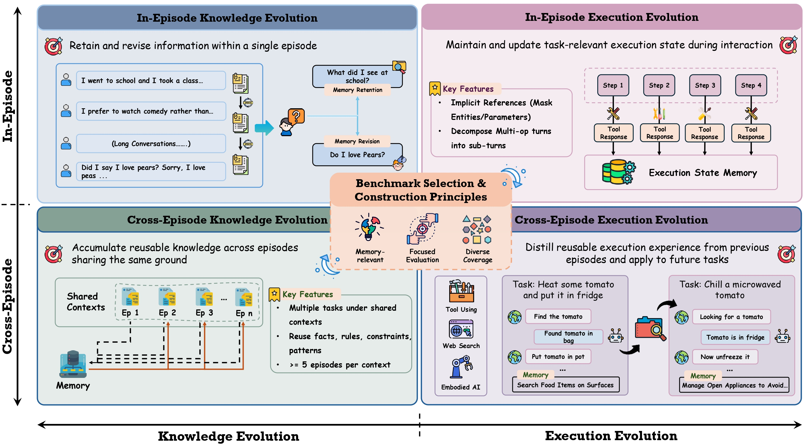

# EvoMemBench




EvoMemBench is a benchmark suite for evaluating memory mechanisms in LLM-based agents from a self-evolving perspective. It accompanies the paper [EvoMemBench: Benchmarking Agent Memory from a Self-Evolving Perspective](https://arxiv.org/abs/2605.18421).

The benchmark follows the taxonomy in the paper and organizes self-evolving memory along two axes:

- **Memory scope**: whether memory is used within a single episode or transferred across episodes.
- **Memory content**: whether memory primarily supports knowledge-oriented question answering or execution-oriented agent behavior.

This yields four forms of memory evolution: in-episode knowledge, in-episode execution, cross-episode knowledge, and cross-episode execution. 


## Benchmark Overview

| Setting | Benchmark | Source / domain | Samples | Directory |
| --- | --- | --- | --- | --- |
| In-episode knowledge | InEp-Know | MemoryAgentBench: Accurate Retrieval and Selective Forgetting | 2,800 | `In-Episode-Knowledge/INEP-KNOW/` |
| In-episode execution | InEp-Exec | BFCL-MultiTurn-LongContext: file system, vehicle control, trading, travel | 800 | `In-Episode-Execution/INEP-EXEC/` |
| Cross-episode knowledge | CrossEp-Know | CL-Bench: facts, rules, procedures, empirical patterns | 884 | `Cross-Episode-Knowledge/CROSSEP-KNOW/` |
| Cross-episode execution | CrossEp-Tool | BFCL-MultiTurn-Base: four tool-use environments | 800 | `Cross-Episode-Execution/Tool-Using/CROSSEP-TOOL/` |
| Cross-episode execution | CrossEp-Web | xbench-DeepSearch and WebWalkerQA | 270 | `Cross-Episode-Execution/Web-Search/CROSSEP-WEB/` |
| Cross-episode execution | CrossEp-Emb | ALFWorld: six embodied task categories | 200 | `Cross-Episode-Execution/Embodied-AI/CROSSEP-EMB/` |

## Dataset Locations and Downloads

The paths below are relative to the repository root and were collected from the task READMEs, launch scripts, and data-loading code.

| Benchmark | Subset | Data path or download source |
| --- | --- | --- |
| InEp-Know | `eventqa_full`, `eventqa_65536`, `eventqa_131072`, `longmemeval_s_-1_500`, `longmemeval_s*`, `ruler_qa1_197K`, `ruler_qa2_421K` | Hugging Face dataset id: `ai-hyz/MemoryAgentBench`, split `Accurate_Retrieval`; local mirror: `In-Episode-Knowledge/INEP-KNOW/MemoryAgentBench/data/Accurate_Retrieval.json` |
| InEp-Know | `factconsolidation_sh_6k`, `factconsolidation_sh_32k`, `factconsolidation_sh_64k`, `factconsolidation_sh_262k`, `factconsolidation_mh_6k`, `factconsolidation_mh_32k`, `factconsolidation_mh_64k`, `factconsolidation_mh_262k` | Hugging Face dataset id: `ai-hyz/MemoryAgentBench`, split `Conflict_Resolution`; local mirror: `In-Episode-Knowledge/INEP-KNOW/MemoryAgentBench/data/Conflict_Resolution.json` |
| InEp-Exec | `gorilla_fs`, `vehicle_control`, `trading_bot`, `travel_api` | `In-Episode-Execution/INEP-EXEC/bfcl_eval/data/BFCL_v4_multi_turn_ours.json`; answers: `In-Episode-Execution/INEP-EXEC/bfcl_eval/data/possible_answer/BFCL_v4_multi_turn_ours.json` |
| CrossEp-Know | `Rule System Application`, `Domain Knowledge Reasoning`, `Procedural Task Execution`, `Empirical Discovery & Simulation` | `Cross-Episode-Knowledge/CROSSEP-KNOW/CL-bench_context_ge5.jsonl` |
| CrossEp-Tool | `gorilla_fs`, `vehicle_control`, `trading_bot`, `travel_api` | `Cross-Episode-Execution/Tool-Using/CROSSEP-TOOL/bfcl_eval/data/BFCL_v4_multi_turn_ours.json`; answers: `Cross-Episode-Execution/Tool-Using/CROSSEP-TOOL/bfcl_eval/data/possible_answer/BFCL_v4_multi_turn_ours.json` |
| CrossEp-Web | `xbench` / XBench DeepSearch | `Cross-Episode-Execution/Web-Search/CROSSEP-WEB/Flash-Searcher-main/data/xbench/DeepSearch.csv` |
| CrossEp-Web | `webwalkerqa` / WebWalkerQA | `Cross-Episode-Execution/Web-Search/CROSSEP-WEB/Flash-Searcher-main/data/webwalkerqa/webwalkerqa_subset_170.jsonl` |
| CrossEp-Emb | `pick_and_place_simple`, `pick_two_obj_and_place`, `pick_clean_then_place_in_recep`, `pick_cool_then_place_in_recep`, `pick_heat_then_place_in_recep`, `look_at_obj_in_light` | ALFWorld download command from setup: run `alfworld-download` after setting `ALFWORLD_DATA=~/.cache/alfworld` |

The four cells in the taxonomy are instantiated as follows:

| Memory scope | Knowledge-oriented memory | Execution-oriented memory |
| --- | --- | --- |
| In-episode | Retain and revise facts, constraints, and long-context evidence during one episode. | Maintain task progress, tool outputs, intermediate results, and unresolved subgoals during one episode. |
| Cross-episode | Accumulate reusable knowledge from earlier episodes sharing the same context. | Distill reusable procedures, action routines, and environment-specific experience for later episodes. |

## Repository Layout

```text
EvoMemBench/
|-- In-Episode-Knowledge/
|   `-- INEP-KNOW/
|-- In-Episode-Execution/
|   `-- INEP-EXEC/
|-- Cross-Episode-Knowledge/
|   `-- CROSSEP-KNOW/
|-- Cross-Episode-Execution/
|   |-- Tool-Using/
|   |   `-- CROSSEP-TOOL/
|   |-- Web-Search/
|   |   `-- CROSSEP-WEB/
|   `-- Embodied-AI/
|       `-- CROSSEP-EMB/
`-- EvoMemBench-Memory-Systems/
```

`EvoMemBench-Memory-Systems/` contains local editable dependencies for memory backends such as `mem0`, `A-mem`, `MemOS`, `MemoryOS`, `MemoBrain`, and `memagent`. These are included to make benchmark runs reproducible across the task suites.

## Installation

Each evaluation setting has its own runtime requirements. We recommend creating a separate Conda environment for each setting.

Typical setup:

```bash
cd <task-directory>
conda create -n <env-name> python=<python-version>
conda activate <env-name>
pip install -r requirements.txt
```

Some settings also require installing memory backends from `EvoMemBench-Memory-Systems/` in editable mode:

```bash
pip install -e ../../EvoMemBench-Memory-Systems/mem0
pip install -e ../../EvoMemBench-Memory-Systems/A-mem
pip install -e ../../EvoMemBench-Memory-Systems/MemOS
pip install -e ../../EvoMemBench-Memory-Systems/MemoryOS
```

The relative path depends on the task directory. See the task-level README before running a benchmark:

- `In-Episode-Knowledge/INEP-KNOW/README.md`
- `In-Episode-Execution/INEP-EXEC/README.md`
- `Cross-Episode-Knowledge/CROSSEP-KNOW/README.md`
- `Cross-Episode-Execution/Tool-Using/CROSSEP-TOOL/README.md`
- `Cross-Episode-Execution/Web-Search/CROSSEP-WEB/README.md`
- `Cross-Episode-Execution/Embodied-AI/CROSSEP-EMB/README.md`
- `EvoMemBench-Memory-Systems/README.md`

## API Keys and Environment Variables

The default inference path in the current benchmark scripts uses Volcengine Ark / DeepSeek batch-style endpoints, and the default embedding path used by several memory backends is DashScope `text-embedding-v4`.

Useful setup links:

- Volcengine Ark batch inference: <https://console.volcengine.com/ark/region:ark+cn-beijing/batchInference>
- Volcengine Ark API keys: <https://console.volcengine.com/ark/region:ark+cn-beijing/apiKey?apikey=%7B%7D>
- DashScope API keys: <https://bailian.console.aliyun.com/cn-beijing?tab=model#/api-key>

For Ark batch inference, the default benchmark configuration uses a DeepSeek-V3.2 batch endpoint.

Common variables:

```bash
# LLM inference, often via Volcengine Ark / DeepSeek-compatible endpoints
DEEPSEEK_API_KEY=<your_api_key>
DEEPSEEK_BASE_URL=<your_base_url>
BATCH_MODEL=<your_batch_endpoint>

# OpenAI-compatible endpoints for model or judge calls
OPENAI_API_KEY=<your_api_key>
OPENAI_BASE_URL=<your_base_url>

# DashScope embeddings, used by several memory backends
DASHSCOPE_API_KEY=<your_dashscope_api_key>
DASHSCOPE_BASE_URL=https://dashscope.aliyuncs.com/compatible-mode/v1

# Web-search setting only
SERPER_API_KEY=<your_serper_api_key>
```

The exact required variables differ by task and backend. Please check the relevant subdirectory README and keep secrets in local `.env` files.

## Evaluation Protocol

EvoMemBench evaluates memory systems with a shared protocol that separates **how memory is used** from **how performance is measured**.

For memory usage, each setting follows the scope defined by the benchmark taxonomy. In in-episode settings, memory is initialized for one episode, updated during that episode, and cleared afterward. In cross-episode settings, memory is updated after earlier episodes and reused in later episodes from the same context, dataset subset, or source-to-target transfer pair.

For measurement, EvoMemBench reports task quality and efficiency:

- **Task quality**
  - Knowledge-oriented tasks: answer accuracy.
  - Execution-oriented tasks: success rate and, where available, progress-oriented statistics.
- **Efficiency**: token usage from both the agent and the memory module.

Most task metrics can be read directly from the generated output files. `InEp-Know` has a few special reporting rules:

- EventQA subset: report `eventqa_recall`.
- LongMemEval / LongMemEval(s*) subsets: run `MemoryAgentBench/llm_based_eval/longmem_qa_evaluate.py`, then report the resulting `Accuracy`.
- Other subsets: report `substring_exact_match`.

The paper compares memory-free long-context LLM baselines with memory-augmented agents. Memory methods are grouped into five families:

| Family | Examples |
| --- | --- |
| Retrieval-augmented memory | BM25, Qwen3-Emb-4B, GraphRAG |
| Short-term memory | MemAgent, MemoBrain |
| General long-term memory | mem0, A-mem, MemOS, MemoryOS |
| Procedural long-term memory | AWM, SkillWeaver, AgentKB, ACE, ReasoningBank |
| Meta-evolution memory | MemEvolve |

## Running Evaluations

Start with a smoke test in the task you want to use, then scale to the full run.

When adding a new memory system or experiment configuration, the recommended workflow is:

1. Read the README in the target task directory.
2. Find an existing `mem0` script for that task.
3. Copy the script and update the memory type, config paths, output directory, API parameters, and smoke-test limits.
4. Run a small smoke test before launching the full evaluation.

For CrossEp-Know, compare memory-augmented runs against the included no-memory baseline unless you intentionally regenerate it:

```bash
cd Cross-Episode-Knowledge/CROSSEP-KNOW
bash run_context_memory.sh \
    --memory-type <memory_backend> \
    --top-k 10 \
    --baseline outputs/context_nomemory/CL-bench_context_ge5_deepseek-v3-2-251201_ctx_nomemory_graded.jsonl
```

To regenerate the baseline, run `bash scripts/nomemory_deepseek-v3.2.sh` from `Cross-Episode-Knowledge/CROSSEP-KNOW/`.

## Memory Systems

The benchmark currently includes adapters or localized dependencies for the following memory systems:

| System | Location | Notes |
| --- | --- | --- |
| mem0 | `EvoMemBench-Memory-Systems/mem0/` | General-purpose memory layer for LLM agents. |
| A-mem | `EvoMemBench-Memory-Systems/A-mem/` | Agentic memory with semantic evolution. |
| MemOS | `EvoMemBench-Memory-Systems/MemOS/` | Memory operating system with vector-store support. |
| MemoryOS | `EvoMemBench-Memory-Systems/MemoryOS/` | Hierarchical short-, mid-, and long-term memory. |
| MemoBrain | `EvoMemBench-Memory-Systems/MemoBrain/` | Reasoning-graph working memory; requires a local vLLM server. |
| memagent | `EvoMemBench-Memory-Systems/memagent/` | Server-side RL memory agent; requires vLLM deployment. |

Task-level benchmark code also contains lightweight, retrieval, workflow, and reasoning-bank style baselines. See each task directory for the exact list supported in that setting.

## Adding a New Memory Backend

The recommended integration path depends on the task:

1. Check whether the memory system is a reusable backend. If yes, place its package or local dependency under `EvoMemBench-Memory-Systems/`.
2. Add a task-specific adapter in the relevant benchmark directory.
3. Register the backend in the task's memory factory or provider registry.

For concrete adapter examples, start from the `mem0` implementations in each task.

## Ackowledgements

EvoMemBench is built based on the following repositories: 
- [MemoryAgentBench](https://github.com/HUST-AI-HYZ/MemoryAgentBench)
- [MemEvolve](https://github.com/bingreeky/MemEvolve)
- [CL-Bench](https://github.com/Tencent-Hunyuan/CL-bench)
- [BFCL](https://github.com/ShishirPatil/gorilla/tree/main/berkeley-function-call-leaderboard)
- [AgentGym](https://github.com/WooooDyy/AgentGym)

## Citation

If you use EvoMemBench in your research, please cite:

```bibtex
@article{wang2026evomembench,
  title={EvoMemBench: Benchmarking Agent Memory from a Self-Evolving Perspective},
  author={Wang, Yuyao and Zhang, Zhongjian and Chi, Mo and Yu, Kaichi and Li, Yuhan and Peng, Miao and Tong, Bing and Zhang, Chen and Zhou, Yan and Li, Jia},
  journal={arXiv preprint arXiv:2605.18421},
  year={2026}
}
```
